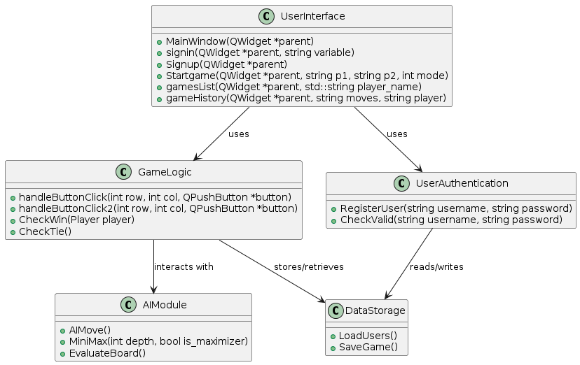
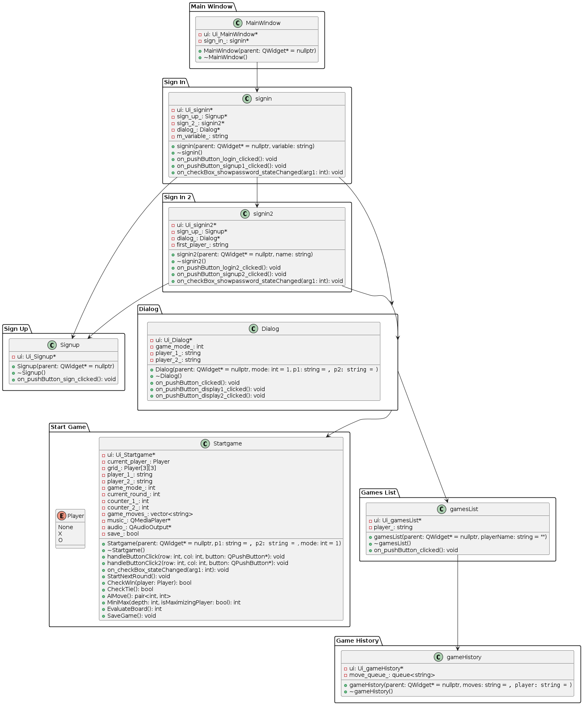
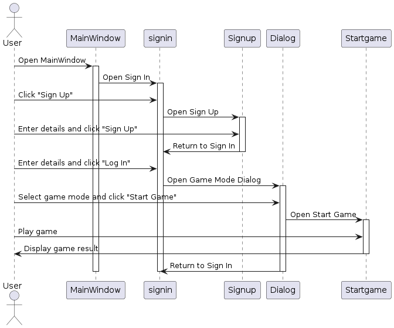
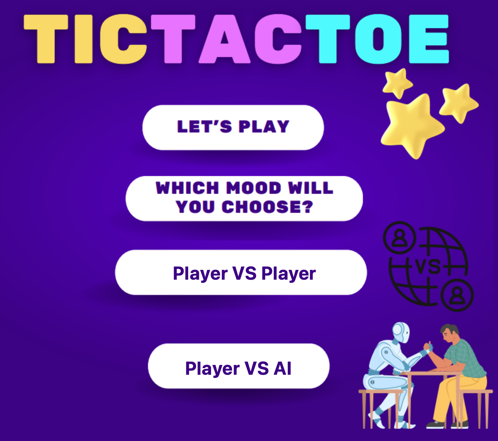
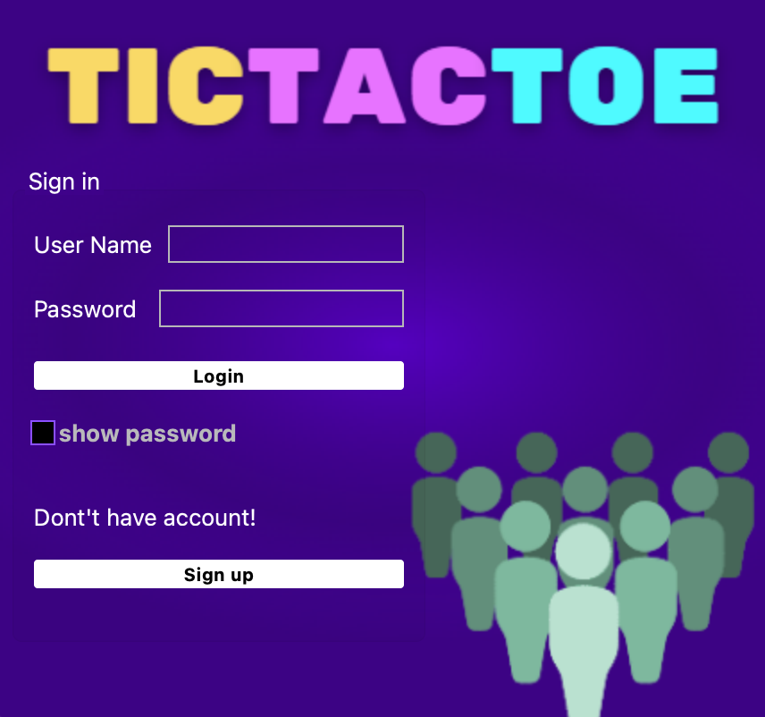
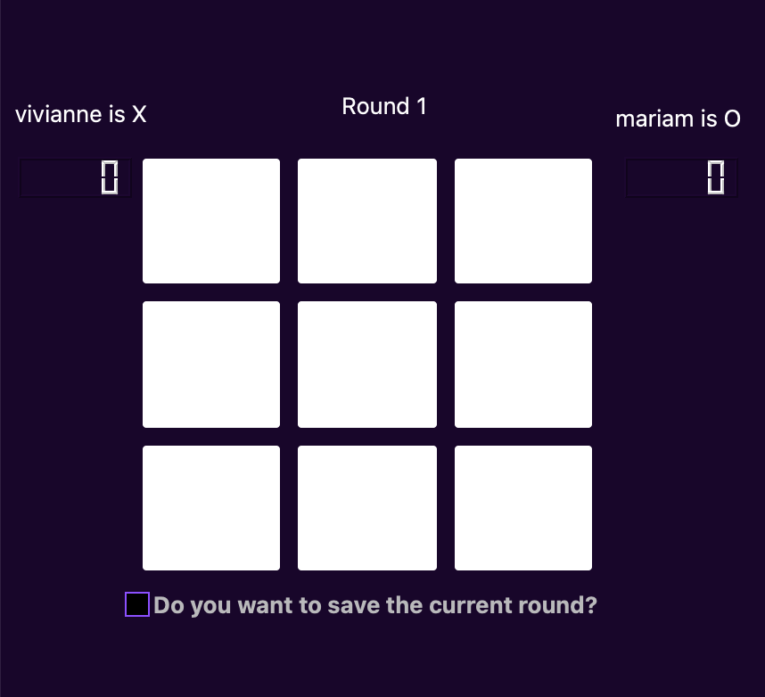
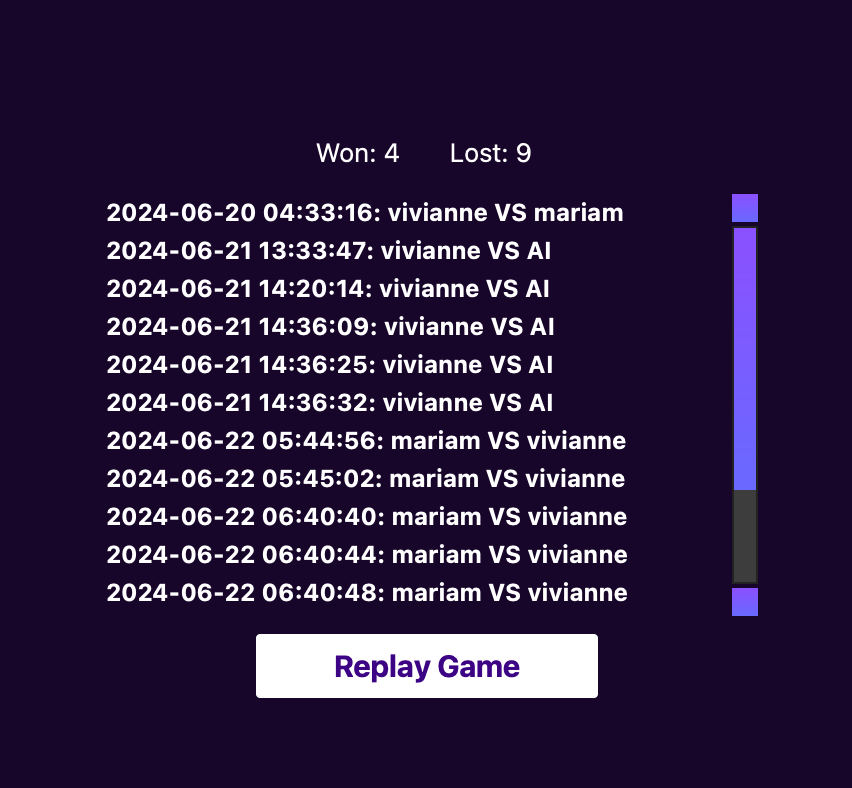

# Advanced Tic Tac Toe

## Introduction
Advanced Tic Tac Toe is an enhanced version of the classic Tic Tac Toe game. This project aims to deliver an engaging user experience by offering both player-versus-player (PvP) and player-versus-AI (PvAI) modes, user authentication, personalized game history tracking, and an intelligent AI opponent.

## Features
- **Gameplay Modes**:
  - **Player-versus-Player (PvP)**: Two human players compete against each other.
  - **Player-versus-AI (PvAI)**: A single player competes against an AI opponent with strategic algorithms.
- **User Authentication**:
  - Secure login and registration.
  - Password hashing for secure storage.
- **Personalized Game History**:
  - Storage and retrieval of game histories for each user.
  - Ability to review and replay past games.
- **Graphical User Interface (GUI)**:
  - Intuitive interface displaying the Tic Tac Toe board.
  - User-friendly screens for registration, login, and profile management.
- **AI Opponent**:
  - AI uses the minimax algorithm for optimal moves.

## System Requirements
- **Operating Systems**: Windows, macOS, Linux
- **Programming Language**: C++
- **GUI Framework**: Qt
- **Development Tools**: Qt Creator or any C++ IDE, Git for version control
- **Testing**: GoogleTest framework

## Installation
1. **Clone the Repository**:
   ```bash
   git clone https://github.com/Jolinejo/advanced-tic-tac-toe.git
   cd advanced-tic-tac-toe
   cd tictactoev
   ```

2. **Install Dependencies**:
   Ensure you have Qt installed. You can download it from [Qt's official website](https://www.qt.io/download).

3. **Build the Project**:
   Open the project in Qt Creator and build it, or use the following command line instructions:
   ```bash
   mkdir -p build
   cd build
   qmake ../tictactoe.pro
   make
   ```

## Usage
1. **Run the Application**:
   After building the project, run the executable:
   ```bash
   ./tictactoe
   ```

2. **Login or Register**:
   - If you are a new user, register by providing a username and password.
   - If you are an existing user, log in with your credentials.

3. **Start a Game**:
   - Choose between PvP or PvAI mode.

4. **Play the Game**:
   - Follow the standard Tic Tac Toe rules.
   - The game will display the winner or indicate a tie.

5. **View Game History**:
   - Access your game history to review past games.

## Testing
1. **Download GoogleTest**:
   Download GoogleTest from [GoogleTest GitHub repository](https://github.com/google/googletest).

2. **Configure GoogleTest Directory**:
   Navigate to the testing directory
   ```bash
   cd test/tictactoev
   ```

3. **Run Tests**:
   Build and run the tests to ensure everything is working correctly:
   ```bash
   mkdir -p build
   cd build
   qmake ../tictactoe.pro
   make
   ./tictactoe
   ```

## Software Design Specification (SDS) Diagrams
This section provides the Software Design Specification (SDS) diagrams for the Advanced Tic Tac Toe project. These diagrams help in understanding the architecture, data flow, and interactions within the system.

1. **Architecture Diagram**:
   

2. **Class Diagram**:
   

3. **Sequence Diagram**:
   


## Game Screenshots
This section includes screenshots of the Advanced Tic Tac Toe game to give a visual understanding of the user interface and gameplay.

1. **Main Menu**:
   

2. **Login Screen**:
   

3. **Game Board**:
   

4. **Game History**:
   

## Contributing
We welcome contributions! Follow these steps to contribute:
1. Fork the repository.
2. Create a new branch (`git checkout -b feature-branch`).
3. Make your changes and commit them (`git commit -m 'Add new feature'`).
4. Push to the branch (`git push origin feature-branch`).
5. Create a Pull Request.


## Acknowledgements
This project was developed by [Vivianne Emad](https://github.com/ViviannEmad), [Mariam Ibrahim](https://github.com/Jolinejo), [Noor Ashraf](https://github.com/NoorAshraff), [Yara Magdy](https://github.com/Yaraamaggdy) and [Yara Osama](https://github.com/Yarausama) as part of their coursework at Cairo University. Special thanks to the professors and mentors who guided us throughout the project.
